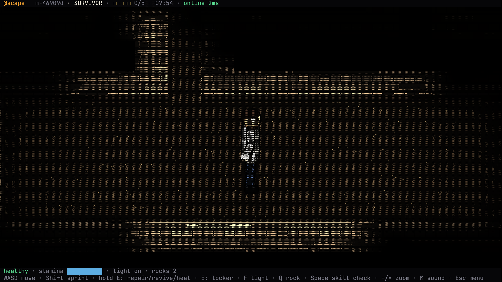
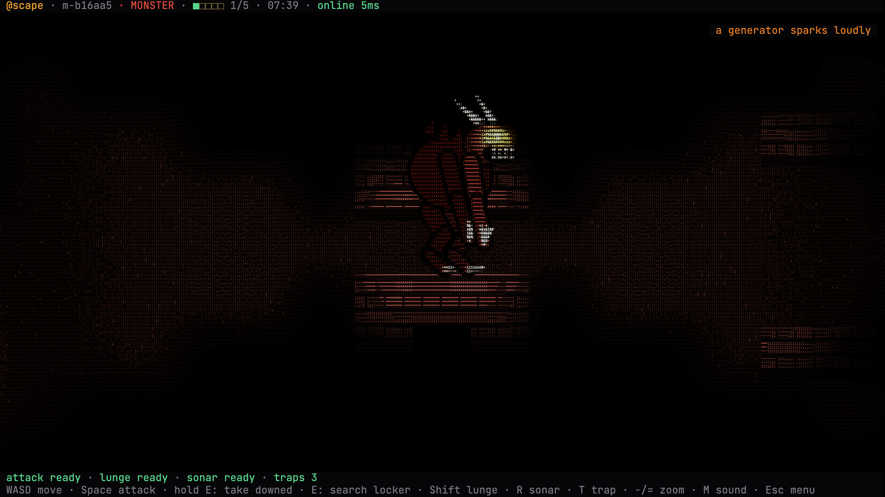
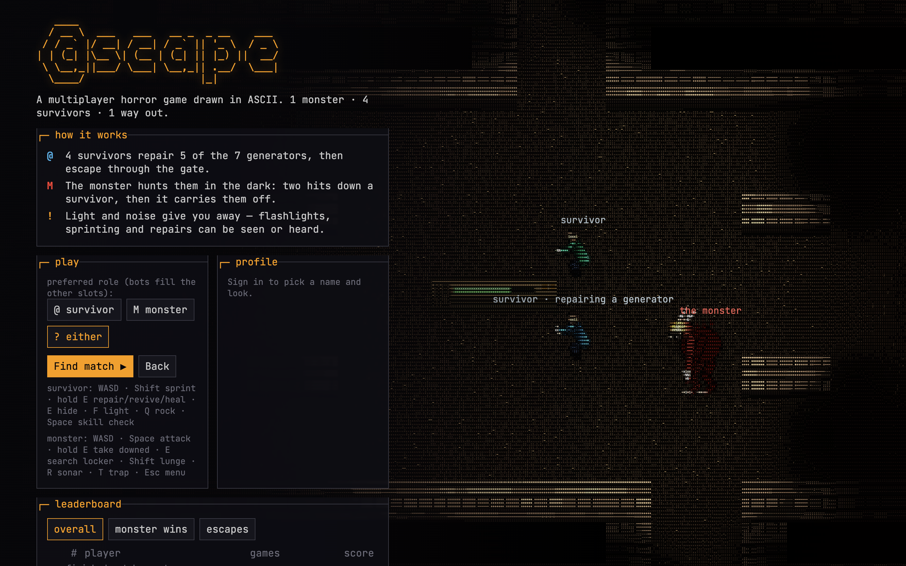

# @scape

A real-time multiplayer horror game drawn entirely in coloured ASCII. **Asymmetric Hunt**: 1 monster against 4
survivors on a dark map. Survivors repair 5 of 7 generators to open the gate and escape; the monster hunts them by
sight, sound and scratch marks. Empty slots are filled by bots, so you can play solo, and bots take over for
players who drop out.



| Monster view (red dark-vision) | Menu over the live attract-mode scene |
|---|---|
|  |  |

## Highlights

- **Server-authoritative** Spring Boot game server over raw WebSocket; clients send inputs, never positions.
- **Client-side prediction + reconciliation + interpolation**, verified with 0 corrections under 200 ms RTT.
  Movement is deterministic and shared: Java and TypeScript both run [`shared/fixtures/movement-cases.json`](shared/fixtures/movement-cases.json).
- **Anti-wallhack by design**: every snapshot is filtered per player (line of sight, light radius, sonar). Enemies
  you cannot see are never serialised; the monster hears sounds as a *direction*, never a position. Covered by
  [`SnapshotVisibilityTest`](server/src/test/java/dev/ascape/game/room/SnapshotVisibilityTest.java).
- **Fair bot AI** through the same input path as humans and the same visibility filter: A* pathfinding, a monster
  FSM (patrol → investigate → chase → search) and survivor utility AI (repair, flee out of sight, hide, revive,
  heal, escape), with reaction delay and difficulty levels.
- **Attract mode**: the menu floats over a scripted scene rendered by the same ASCII pipeline — survivors repair a
  generator, the monster creeps out of the dark, strikes, and the chase begins — with captions, so visitors grasp
  the game before pressing play.
- **Matchmaking** into lobbies only, honouring the monster preference, with bot fill and 30 s reconnect grace.
- **Image-to-ASCII renderer**: the world is painted as a small picture (1 pixel per character cell: brick walls,
  lit floor, machines, and characters drawn as shaded, animated vector rigs — a walking/sprinting survivor and a
  hunched horned monster with glowing eyes), multiplied by a smoothly interpolated light map, then converted to
  characters on the GPU by a WebGL shader that picks a glyph from a brightness ramp and tints it with the pixel's
  colour. Tiny glyphs (zoom with `-`/`=`) give tens of thousands of characters on screen; HUD text is a separate
  crisp layer. Plus sound arcs, particles, screen shake, heartbeat vignette, synthesised audio and fullscreen.
- **Supabase** auth (JWT verified against JWKS, guest + magic link) and Postgres persistence through a least-privilege
  role and an async write queue that never touches the game loop.

## Architecture

```
Browser (Vite + TS)                     Spring Boot 4 (Java 21)                        Supabase
┌───────────────────────┐   input 20/s  ┌──────────────────────────────────────┐       ┌───────────────┐
│ KeyboardInput         │ ────────────► │ GameWebSocketHandler (rate limit)    │       │ Auth (JWKS)   │
│ PredictedCharacter    │               │  └► RoomManager (matchmaking)        │       │ Postgres      │
│ SnapshotBuffer (lerp) │ ◄──────────── │      └► GameRoom  ── 1 thread, 20 Hz │ async │  profiles     │
│ SceneRenderer (ASCII) │ snapshot 20/s │           ├ Match (pure simulation)  │ ────► │  player_stats │
│ HUD · effects · audio │  per player   │           ├ Bot ×n (same inputs)     │ queue │  matches      │
└───────────────────────┘               │           └ SnapshotBuilder (filter) │       │  match_players│
                                        └──────────────────────────────────────┘       └───────────────┘
```

- **One thread per room.** Network threads only enqueue commands; the room drains them at the start of each tick,
  so the simulation needs no locks. `Match` is a pure class (no threads, clock or I/O) and is unit-tested directly.
- **Non-blocking fan-out.** Each connection has a bounded outbox drained by its own virtual thread; a client that
  stops reading is disconnected instead of stalling the room (`ClientConnection` + backpressure test).
- **Shared rules.** [`shared/rules.json`](shared/rules.json), the tile legend and maps are read by both the server
  (packaged on the classpath) and the client (bundled by Vite). [`shared/protocol.md`](shared/protocol.md) is the
  wire-protocol source of truth.

### Netcode

1. The client samples input on a fixed 20 Hz step, sends it with a sequence number and immediately applies it to its
   own predicted character using the same movement function as the server.
2. The server consumes at most one input per character per tick. A character with no input is not simulated that
   tick, which keeps the server state after `ackSeq` exactly equal to the client's prediction.
3. Each snapshot carries `ackSeq` and the authoritative state; the client resets to it and replays the inputs the
   server has not seen yet. Mismatches are counted in the F3 overlay.
4. Other players are rendered 100 ms in the past, interpolated between snapshots on the server's timeline.
5. **Lag compensation**: each input carries the tick the client was showing (`viewTick`), and the monster's attack
   is checked against where survivors were at that tick as well as now (rewind capped at 300 ms), from the cell the
   monster just stepped into. Early presses during the cooldown are buffered, the swing's slow is predicted on the
   client, and the server's input backlog is capped at 3 with presses merged forward, so a network hiccup cannot
   leave every later press late or drop it. With 100 ms simulated latency, a scripted monster's hit rate on swings that
   looked adjacent went from 45% (5/11) to 100% (8/8).

Try it with artificial lag: `SIMULATED_LATENCY_MS=100` adds 100 ms each way on the server.

## Numbers

Load test with [`loadtest/`](loadtest/loadtest.mjs) (Node `ws` clients that matchmake, send 20 inputs/s with a
random walk and ping every 2 s), server and load generator on the same laptop (Intel i5-8257U, 4 cores / 8 threads, 2019), no database:

| clients | rooms | server tick p50 / p95 / p99 | tick budget | RTT p50 / p95 | download per client | errors |
|--------:|------:|-----------------------------|------------:|---------------|--------------------:|-------:|
| 100 | 20 | 0.31 / 0.72 / 1.44 ms | 50 ms | 2.1 / 5.6 ms | 25 KB/s | 0 |
| 500 | 99 | 0.15 / 0.43 / 0.89 ms | 50 ms | 10.5 / 52 ms | 26 KB/s | 0 |

At 500 clients the server used ~2.4 cores and ~380 MB RSS, mostly for JSON serialisation (≈13 MB/s). The RTT tail
at 500 is inflated by the single-threaded load generator sharing the machine. Bandwidth is the obvious next target
(binary encoding + delta snapshots, plan M9).

A bot-only match simulation (5 bots, full match) costs ~60–200 µs per tick.

## Technical decisions

- **Raw WebSocket, not STOMP or MQTT.** One connection per player, custom JSON envelope, no broker. MQTT is built
  for IoT fan-out through a broker and adds a hop; STOMP adds framing we do not need.
- **Server-authoritative + visibility filtering.** The only way to make wallhacks impossible is to never send what
  the player may not see. It also makes the bots fair: they perceive through the same filter.
- **Grid-step movement instead of float physics.** It matches the ASCII grid, makes prediction bit-for-bit
  deterministic across Java and TypeScript, and keeps A* and line of sight simple. Smoothness comes from
  interpolating rendering, not from the simulation.
- **Plain `spring-jdbc` + Hikari instead of the JDBC starter.** Without a database URL the server runs with an
  in-memory store, so tests and local play need no database.
- **Least-privilege database role.** The server connects as `ascape_server`, which can only touch the game tables
  (RLS policies, no access to `auth.*`); the admin connection is only for migrations.
- **Spring Boot 4.1** (the 3.x line is no longer offered by start.spring.io); Jackson 3 (`tools.jackson`).

## Project layout

| Path | What |
|---|---|
| `server/` | Spring Boot game server: `net` (WebSocket, protocol), `game/match` (simulation), `game/room` (lifecycle, snapshots, matchmaking), `game/bot` (AI), `auth`, `player` (persistence), `api` (REST) |
| `client/` | Vite + TypeScript: `game` (prediction, interpolation, lighting), `render` (ASCII grid, HUD, effects), `net`, `ui`, `audio`, `auth` |
| `shared/` | `protocol.md`, `rules.json`, `maps/` (map files + tile legend), `fixtures/` (cross-language tests) |
| `supabase/migrations/` | Schema, RLS, server role |
| `loadtest/` | WebSocket load generator |

## Running locally

Requirements: Java 21, Node ≥ 20.19. Copy `.env.example` to `.env` (the server reads it on startup).

```bash
# terminal 1 — server on :8080 (add AUTH_ALLOW_UNAUTHENTICATED=true to play without Supabase)
cd server && ./mvnw spring-boot:run

# terminal 2 — client on :5173 (proxies /ws and /api to :8080)
cd client && npm install && npm run dev
```

Without `VITE_SUPABASE_*` the client skips sign-in and plays as a guest, which needs
`AUTH_ALLOW_UNAUTHENTICATED=true` on the server. Or everything in Docker: `docker compose up --build`
(client on :8081).

To play from a phone on the same Wi-Fi, `scripts/dev-lan.sh` starts both (guest mode, nothing saved) and prints
`http://<laptop-ip>:5173`; `--auth` uses the Supabase settings from `.env` instead. Ctrl+C stops both.

### Configuration (server)

| Env var | Default | Purpose |
|---|---|---|
| `SUPABASE_URL` | – | Verifies access tokens against the project's JWKS |
| `DB_URL`, `DB_USER`, `DB_PASSWORD` | – | JDBC connection as `ascape_server`; empty = in-memory store |
| `ALLOWED_ORIGINS` | `http://localhost:5173` | Browser origins for the WebSocket and CORS |
| `AUTH_ALLOW_UNAUTHENTICATED` | `false` | Accept tokenless guests (dev, load tests) |
| `BOT_DIFFICULTY` | `normal` | `easy`, `normal`, `hard` |
| `ASCAPE_MAPID` | `manor` | Map from `shared/maps/<id>.map.txt`; `arena` is a small open map for quick tests |
| `SIMULATED_LATENCY_MS` | `0` | Extra one-way latency, for netcode demos |
| `ASCAPE_DEBUG_LOBBYCOUNTDOWNSECONDS` | rules.json | Shorter lobby countdown for testing |
| `BOT_DEBUG_VIEW` | `false` | Sends bot states and paths to clients (F4). Reveals positions — dev only |

Client build: `VITE_SUPABASE_URL`, `VITE_SUPABASE_PUBLISHABLE_KEY`, and `VITE_SERVER_URL` when the client is hosted
on a different origin than the server.

### Supabase setup

1. Apply `supabase/migrations/*.sql` (`supabase db push`, or run them in order).
2. Set a password for the server role: `alter role ascape_server with password '…';` and use
   `ascape_server.<project-ref>` as `DB_USER` with the session pooler URL.
3. Auth → Providers: enable **anonymous sign-ins** (guest play) and email (magic link).
   Auth → URL configuration: add your client URLs to the redirect allow-list.

## Deploying

The server runs on [Render](https://render.com) (Docker, free plan) and the client on [Vercel](https://vercel.com).

**Server (Render)**: Dashboard → New → Blueprint → pick the repo; [`render.yaml`](render.yaml) builds
`server/Dockerfile` from the repo root. Fill in the secret env vars when asked: `SUPABASE_URL`, `DB_URL`,
`DB_USER`, `DB_PASSWORD`, and `ALLOWED_ORIGINS` = the Vercel URL. The image's JVM flags are sized for 512 MB
(100 simultaneous clients measured at ~220 MB RSS). The free plan sleeps after 15 minutes idle; the first
visitor wakes it (up to a minute). The menu's leaderboard request starts that early, and the connecting panel says
what is happening.

**Client (Vercel)**: import the repo with Root Directory `client` (keep "Include files outside the root
directory" on: the build reads `../shared`). Env vars: `VITE_SERVER_URL` = the Render URL (e.g.
`https://ascape-server.onrender.com`), `VITE_SUPABASE_URL`, `VITE_SUPABASE_PUBLISHABLE_KEY`. Then add the Vercel
URL to Supabase Auth → URL configuration (site URL and redirect list).

## Controls

| | Survivor | Monster |
|---|---|---|
| Move | WASD / arrows, Shift sprint | WASD / arrows |
| E | hold: repair, revive, heal · press: hide in / leave a locker | hold: carry off a downed survivor · press: search a locker |
| Space | skill check | attack (also left click or J) |
| Other | F flashlight · Q throw a rock (fake noise) | Shift lunge · R sonar · T trap |

Esc menu · `-`/`=` zoom · M sound · F2 CRT · F3 netcode overlay · F4 bot debug view (if enabled on the server).

**Objectives** are shown in game: each match opens with a short briefing for your role, and survivors get a marker
that points to the escape gate (dim while it is locked, lit once the generators are done).

**Playing with friends**: the lobby shows a room code; friends type it on the menu to join. The host (whoever has
been in the room longest) can press `H` to hold the countdown while they gather, and `H` again to start it — the
match begins when it runs out. Others may still join a held lobby, from the code or from matchmaking.

**Phones and tablets**: a floating stick on the left half (push it to the edge to sprint) and role buttons on the
right (SKILL / ATTACK, USE, LIGHT, ROCK / LUNGE, SONAR, TRAP). They press the same keys as a keyboard player, so
the netcode is identical. Landscape recommended.

## Tests

```bash
cd server && ./mvnw verify          # 77 tests: simulation, visibility, bots, protocol, auth, backpressure
cd client && npm test && npm run build   # 42 tests: movement parity, prediction, interpolation, lighting, animation, touch stick
cd loadtest && npm install && node loadtest.mjs --clients 100 --seconds 30
```

CI runs both suites on every push ([`.github/workflows/ci.yml`](.github/workflows/ci.yml)).

## License

[MIT](LICENSE)
